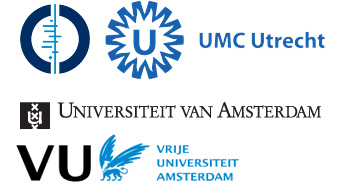
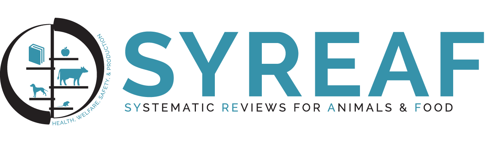

[Home](index.md)|[About](about.md)|[Resources](resources.md)|[Events](events.md)|[Papers](papers.md)|[2024 ICASR meeting](2024_meeting.md)|  

ICASR is an international collaboration between several groups working in systematic reviews, automation, or both. ICASR holds an annual meeting to foster collaboration between groups working on review automation (see Events for a list of past events).

The following is a partial list of the collaborators:  

**[The Institute for Evidence-Based Healthcare at Bond University](https://iebh.bond.edu.au){:target="_blank"}**

**[The EPPI-Centre at University College London](http://eppi.ioe.ac.uk/cms/){:target="_blank"}**

  
**[Cochrane Netherlands](https://netherlands.cochrane.org/){:target="_blank"}/[Julius center for Health research and primary care](http://portal.juliuscentrum.nl/en-us/home.aspx){:target="_blank"}/[ILPS-University of Amsterdam](http://ilps.science.uva.nl/){:target="_blank"}/[KR&R-VU Amsterdam](https://krr.cs.vu.nl/){:target="_blank"}**

  
**[Systematic Reviews for Animal and Food (SYREAF)](http://www.syreaf.org){:target="_blank"}**

**[National Institute of Environmental Health Sciences (NIEHS)](https://www.niehs.nih.gov/){:target="_blank"}**

**[U.S. Environmental Protection Agency (U.S. EPA)](https://www.epa.gov/){:target="_blank"}**

**[TU Wien](https://www.tuwien.at/en/){:target="_blank"}**

**[CAMARADES](https://www.ed.ac.uk/clinical-brain-sciences/research/camarades){:target="_blank"}**

**[Norwegian Institute of Public Health (NIPH)](https://www.fhi.no/en/){:target="_blank"}**

**[NIHR Innovation Observatory](https://www.io.nihr.ac.uk/){:target="_blank"}**

**[Cochrane](https://www.cochrane.org/){:target="_blank"}**

**[Campbell Collaboration](https://www.campbellcollaboration.org/){:target="_blank"}**

Other organisations…

